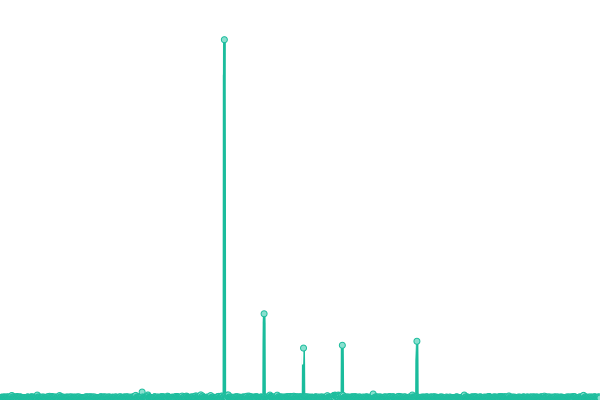
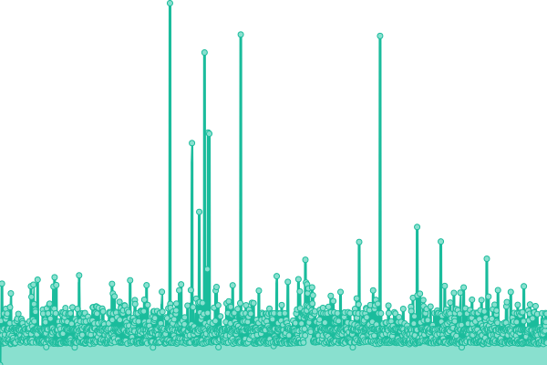
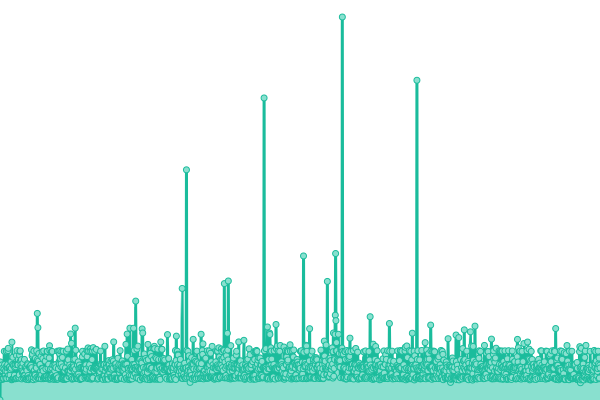

# [📈 Live Status](https://status.kylz.nl): <!--live status--> **🟧 Partial outage**

This repository contains the open-source uptime monitor and status page for [Minoplhy](-> Readme), powered by [Upptime](https://github.com/upptime/upptime).

With [Upptime](https://upptime.js.org), you can get your own unlimited and free uptime monitor and status page, powered entirely by a GitHub repository. We use [Issues](https://github.com/minoplhy/upptime-status/issues) as incident reports, [Actions](https://github.com/minoplhy/upptime-status/actions) as uptime monitors, and [Pages](https://status.kylz.nl) for the status page.

<!--start: status pages-->
<!-- This summary is generated by Upptime (https://github.com/upptime/upptime) -->
<!-- Do not edit this manually, your changes will be overwritten -->
<!-- prettier-ignore -->
| URL | Status | History | Response Time | Uptime |
| --- | ------ | ------- | ------------- | ------ |
|  [[LU] Kylz.nl](https://kylz.nl) | 🟥 Down | [lu-kylz-nl.yml](https://github.com/minoplhy/upptime-status/commits/HEAD/history/lu-kylz-nl.yml) | 

 596ms
     
 | 

<a href="https://status.kylz.nl/history/lu-kylz-nl">93.70%</a>
    

|  [[LU] filters-build webserver](https://filters.kylz.nl) | 🟩 Up | [lu-filters-build-webserver.yml](https://github.com/minoplhy/upptime-status/commits/HEAD/history/lu-filters-build-webserver.yml) | 

 205ms
     
 | 

<a href="https://status.kylz.nl/history/lu-filters-build-webserver">100.00%</a>
    

|  [[LU] Crappy blog](https://kylz.nl/crappy/) | 🟥 Down | [lu-crappy-blog.yml](https://github.com/minoplhy/upptime-status/commits/HEAD/history/lu-crappy-blog.yml) | 

 115ms
     
 | 

<a href="https://status.kylz.nl/history/lu-crappy-blog">93.63%</a>
    

|  [[LU-frontend] [CH-backend] **FAKE**S3 CDN](https://cdn.kylz.nl) | 🟥 Down | [lu-frontend-ch-backend-fake-s3-cdn.yml](https://github.com/minoplhy/upptime-status/commits/HEAD/history/lu-frontend-ch-backend-fake-s3-cdn.yml) | 

 705ms
     
 | 

<a href="https://status.kylz.nl/history/lu-frontend-ch-backend-fake-s3-cdn">93.60%</a>
    

|  [[US] m21 webserver](https://m21.kylz.nl) | 🟥 Down | [us-m21-webserver.yml](https://github.com/minoplhy/upptime-status/commits/HEAD/history/us-m21-webserver.yml) | 

 688ms
     
 | 

<a href="https://status.kylz.nl/history/us-m21-webserver">99.87%</a>
    

<!--end: status pages-->

[**Visit our status website →**](https://status.kylz.nl)

## 📄 License

- Powered by: [Upptime](https://github.com/upptime/upptime)
- Code: [MIT](./LICENSE) © [Minoplhy](-> Readme)
- Data in the `./history` directory: [Open Database License](https://opendatacommons.org/licenses/odbl/1-0/)
